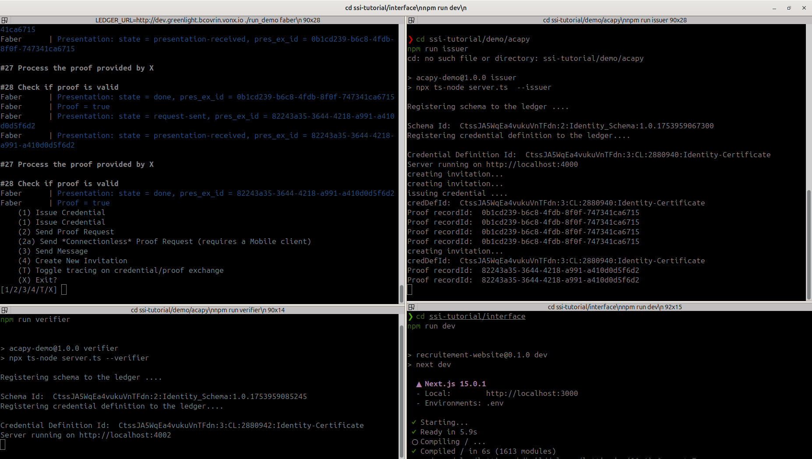
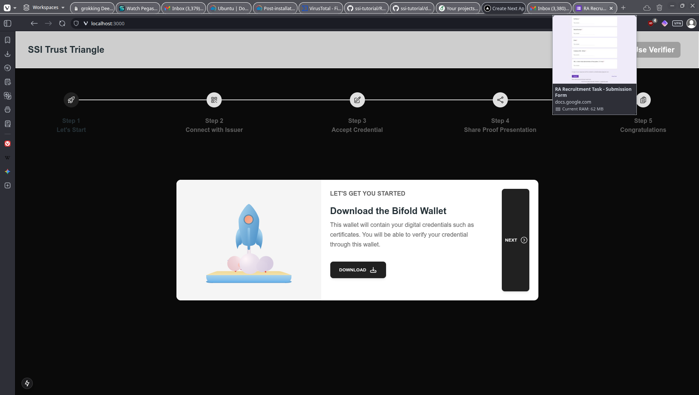
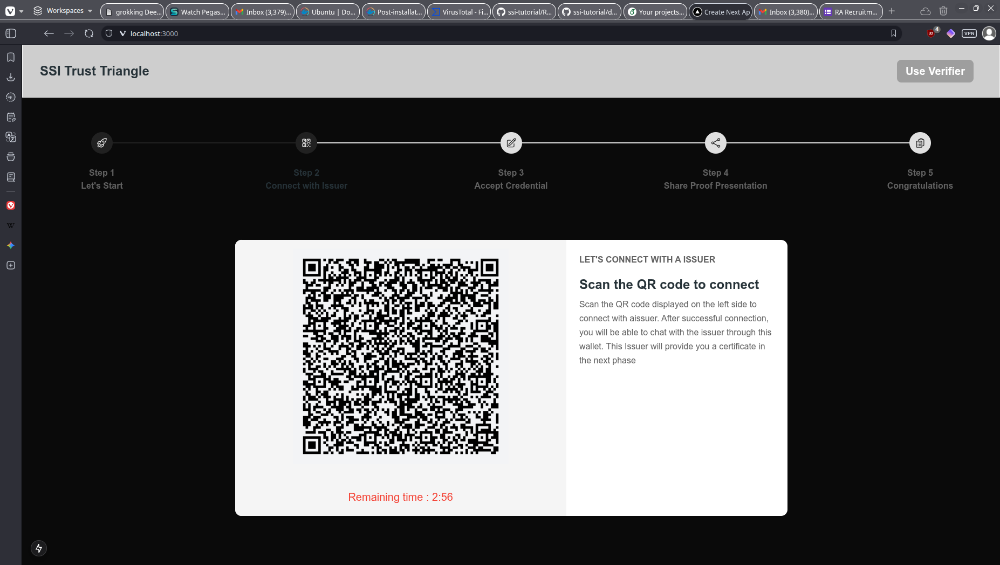
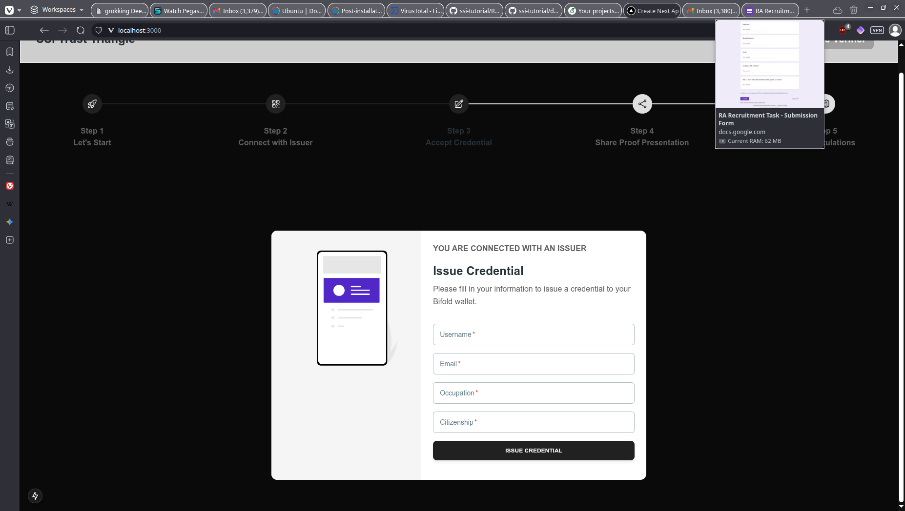
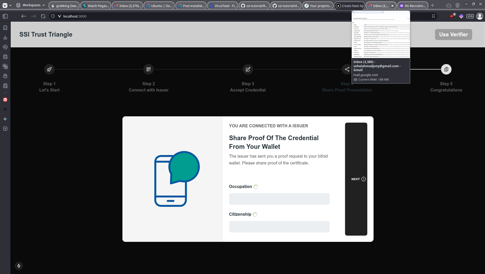
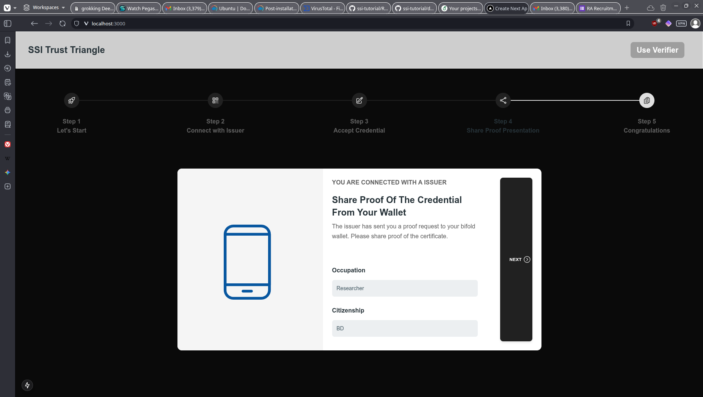
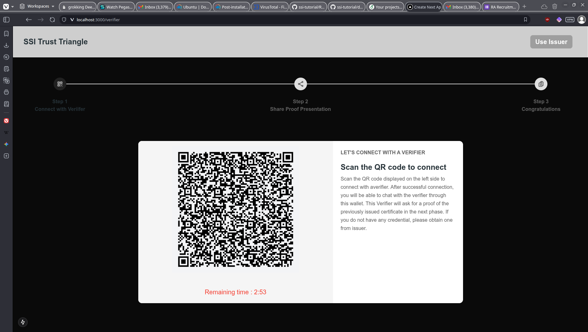
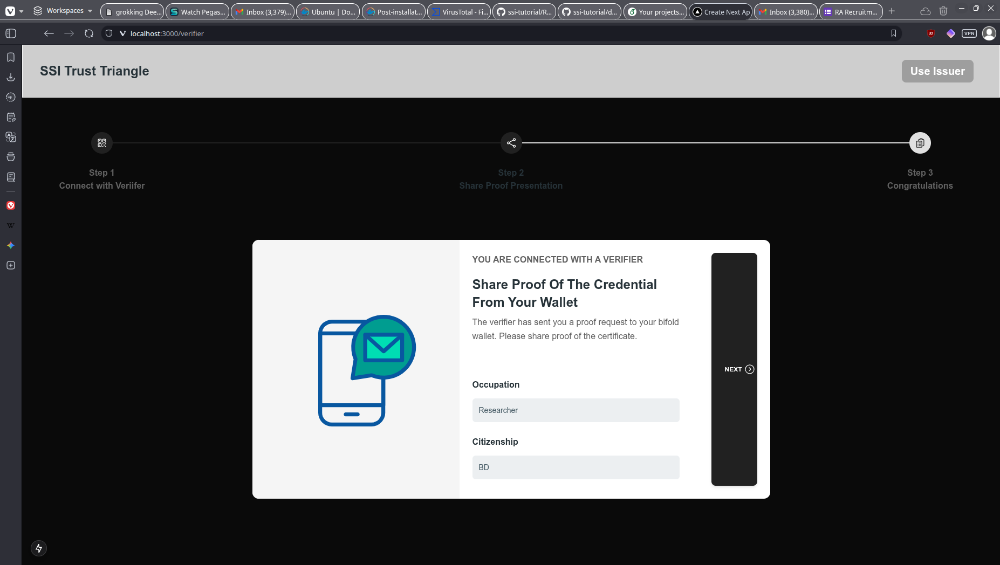
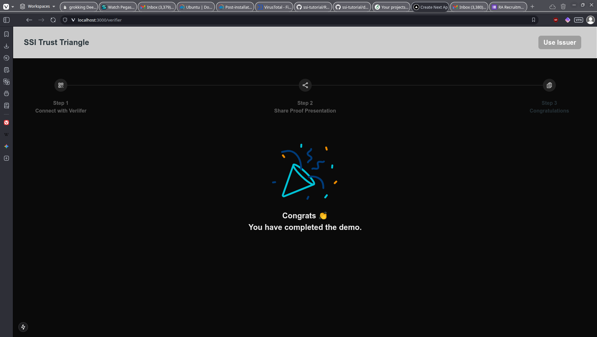

# Enhanced SSI Application Testing Guide
This project showcases a self-sovereign identity flow using ACA-Py agents and a Bifold wallet. An issuer ACA-Py agent issues a VC with username, email, occupation, and citizenship to your mobile wallet. You then generate and share a proof of the VC with a verifier ACA-Py agent, demonstrating credential issuance, storage, and verification.

## Prerequisites
- Docker installed and running
- Node.js and npm/yarn installed
- Python 3.12+ installed
- Ngrok installed and configured
- Bifold wallet app installed on mobile device

## Testing Workflow


### Step 0: Clone the Repository
```bash
git clone https://github.com/JonyBepary/ssi-credential-citizen.git
cd ssi-credential-citizen
```
### Step 1: Start ACAPY Agent (Required First!)

```bash
# In a separate terminal, Start ngrok for port 8020
ngrok http 8020

# In a separate terminal, navigate to the cloned acapy directory
cd acapy/demo
LEDGER_URL=http://dev.greenlight.bcovrin.vonx.io ./run_demo faber
```

**Expected Output:**
- ACAPY agent starts on port 8021 (admin API)
- Agent connects to BCovrin test ledger
- Ngrok provides public endpoint

### Step 2: Start API Server

```bash
# Terminal 2: Start issuer API
cd ssi-tutorial/demo/acapy
npm run issuer

```

**Expected Output:**
- ✅ "Registering schema to the ledger ...."
- ✅ "Schema Id: [some_schema_id]"
- ✅ "Registering credential definition to the ledger...."
- ✅ "Credential Definition Id: [some_cred_def_id]"
- ✅ "Server running on http://localhost:4000"

### Step 3: Start Verifier Server (Optional)

```bash
# In another terminal
# Terminal 3: Start verifier API
cd ssi-tutorial/demo/acapy
npm run verifier
```

### Step 4: Start Web Interface

```bash

# Terminal 4: Start web interface
cd ssi-tutorial/interface
npm run dev

```

**Expected Output:**
- ✅ Interface running on http://localhost:3000


**Expected Output Screenshot:**


*All four terminals should be running simultaneously as shown in the screenshot above.*

## Image Gallery

### Step 5: Testing Screenshots















